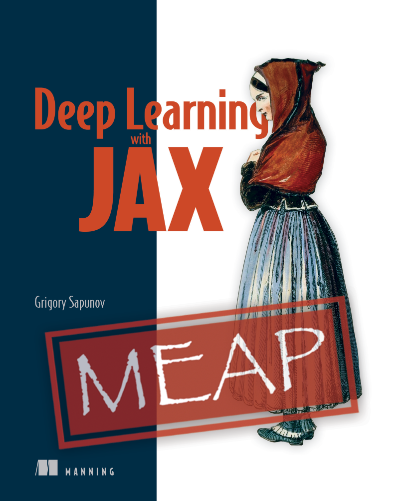

# "Deep Learning with JAX" book

This is a repository accompanying the "[Deep Learning with JAX](https://www.manning.com/books/deep-learning-with-jax)" book (originally called "JAX in Action"). Feel free to use the promotional code **au35sap** for 35% discount for this book and any other Manning's product.

Notebooks for the chapters:
1. [Intro to JAX](Chapter-1)
   - [JAX Speedup](Chapter-1/JAX_in_Action_Chapter_1_JAX_speedup.ipynb)
2. [Your first program in JAX](Chapter-2)
   - [MNIST image classification with MLP in pure JAX](Chapter-2/JAX_in_Action_Chapter_2_MNIST_MLP_Pure_JAX.ipynb)
3. [Working with tensors](Chapter-3)
   - [Image Processing with Tensors](Chapter-3/JAX_in_Action_Chapter_3_Image_Processing.ipynb)
   - [Working with DeviceArray's](Chapter-3/JAX_in_Action_Chapter_3_DeviceArray.ipynb)
4. [Autodiff](Chapter-4)
   - [Different ways of getting derivatives](Chapter-4/JAX_in_Action_Chapter_4_Different_ways_of_getting_derivatives.ipynb)
   - [Working with gradients in TensorFlow, PyTorch, and JAX](Chapter-4/JAX_in_Action_Chapter_4_Gradients_in_TensorFlow_PyTorch_JAX.ipynb)
   - [Differentiating in JAX](Chapter-4/JAX_in_Action_Chapter_4_Differentiating_in_JAX.ipynb)
5. [Compiling your code](Chapter-5)
   - [JIT compilation and more: JIT, Jaxpr, XLA, AOT](Chapter-5/JAX_in_Action_Chapter_5_JIT.ipynb)
6. [Vectorizing your code](Chapter-6)
   - [Different ways to vectorize a function, Controlling vmap() behavior, More real-life cases](Chapter-6/JAX_in_Action_Chapter_6_vmap.ipynb)
7. [Parallelizing your computations](Chapter-7)
   - [Using pmap()](Chapter-7/JAX_in_Action_Chapter_7_pmap.ipynb)
8. [Advanced parallelization](Chapter-8)
   - [Using xmap()](Chapter-8/JAX_in_Action_Chapter_8_xmap.ipynb)
   - [Using pjit()](Chapter-8/JAX_in_Action_Chapter_8_pjit.ipynb)
   - [Tensor sharding](Chapter-8/JAX_in_Action_Chapter_8_Tensor_Sharding.ipynb)
   - [Multi-host example](Chapter-8/worker.py)
9. [Random numbers in JAX](Chapter-9)
   - [Random augmentations, NumPy and JAX PRNGs](Chapter-9/JAX_in_Action_Chapter_9_Random_Numbers.ipynb)
10. [Complex structures in JAX/Pytrees](Chapter-10)
   - [Pytrees, jax.tree_util functions, custom nodes](Chapter-10/JAX_in_Action_Chapter_10_Pytrees.ipynb)
11. more to come

TBD
   
Google ML Developer Programs team supported this work by providing Google Cloud Credit
